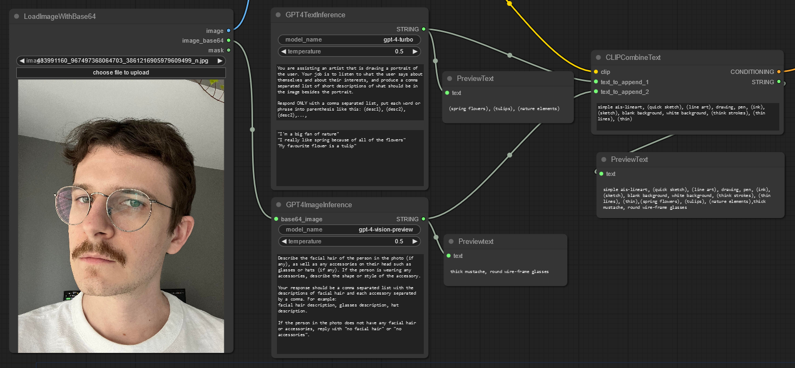
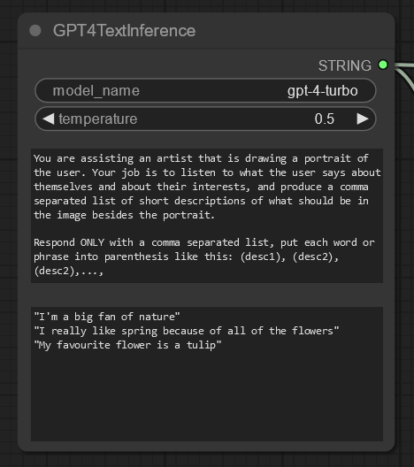
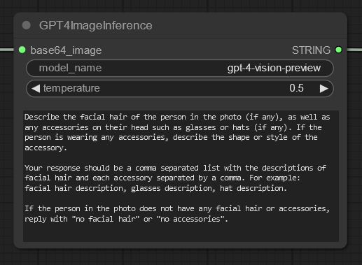
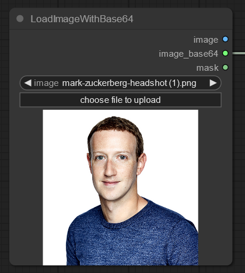
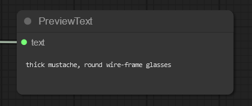
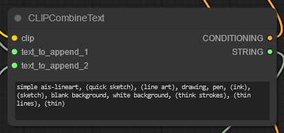
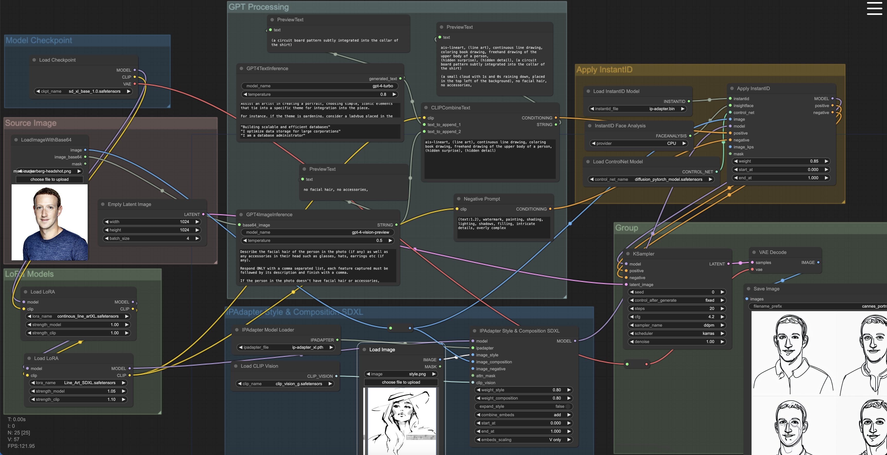
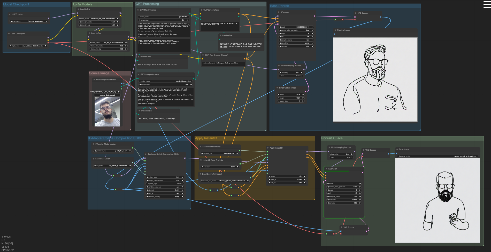
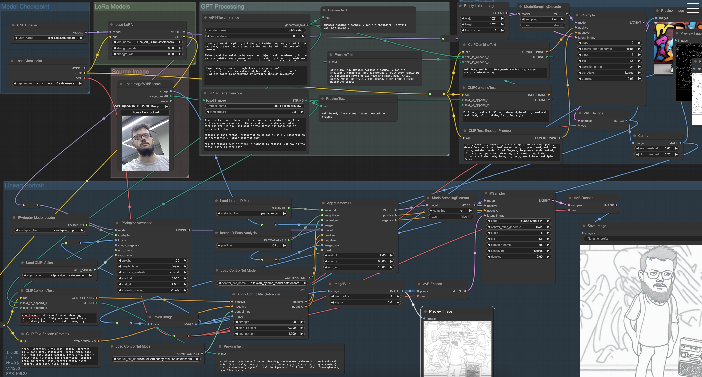
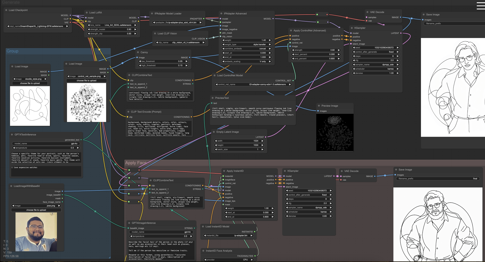

# Custom ComfyUI nodes for Cannes

## Preivew

## Installation

1. Navigate to `ComfyUI/custom_nodes/`
2. Clone this repo
3. Install dependencies with `pip install -r requirements.txt`
4. Add OpenAI key to `credentials.json`

## Custom nodes

#### GPT4TextInference

-   Lets you inference GPT-4 or any other openAI model with a system prompt and a user prompt.
-   Outputs the response from the LLM as a string node connection

#### GPT4ImageInference

-   Lets you use `gpt-4-vision-preview` to describe an image
-   Takes a base64 image string as an input, so it requires using the `LoadImageWithBase64` custom node to load the image
-   Outputs the response from the LLM as a string node connection

#### LoadImageWithBase64

-   Same as the default ComfyUI "LoadImage" node, except it will also return the image as a base64 string
-   Allows you to load an image normally to pass into instantID, as well as passing it into `GPT4ImageInference`

#### PreviewText

-   Simple node that displays any text that is passed into it

#### CLIPCombineText

-   Same as the default ComfyUI "CLIP Text Encode (Prompt)" node, except it also takes a text input that it will append to the prompt
-   `text_to_append_1` is required, and will be appended to the end of the prompt
-   `text_to_append_2` is optional
-   Has an optional string output that can be connected to the `PreviewText` node to view the concatenated text

## Workflows

#### line_art_lorax2_gpt4text+vision_instantid_style&composition

Must install this custom_nodes also:

-   InstantID from https://github.com/cubiq/ComfyUI_InstantID
-   IPAdapterPlus https://github.com/cubiq/ComfyUI_IPAdapter_plus

#### lcm_instantid+style_portrait_base_xl

Same requirements as [line_art_lorax2_gpt4text+vision_instantid_style&composition](https://github.com/Experience-Monks/prj-3248-labs-cannes-demo-hall-2024-comfyui-nodes?tab=readme-ov-file#line_art_lorax2_gpt4textvision_instantid_stylecomposition)+vision_instantid_style&composition

Additionaly, download LCM model from [huggingface](https://huggingface.co/latent-consistency/lcm-sdxl/blob/main/diffusion_pytorch_model.safetensors) and put it in ´models/unet´ folder

#### lcm_base_portrait+face

Same requirements as [lcm_instantid+style_portrait_base_xl](https://github.com/Experience-Monks/prj-3248-labs-cannes-demo-hall-2024-comfyui-nodes?tab=readme-ov-file#lcm_instantid+style_portrait_base_xl)

#### 2pass_base+style&face

Generates initial portrait based on gpt4 suggestions, then a second pass using InstantID for the face traits and a ControlNet that uses the output of detecting edges on the first image result, using canny edge detection as line reference for the element composition.

SDXL Style & Composition node is not present here, it uses an IPAdapter Advanced included in existing custom_nodes from cubiq's IPAdapterPlus: https://github.com/cubiq/ComfyUI_IPAdapter_plus

#### caricature_style

Controlnet model needed (Apply ControlNet node): https://huggingface.co/stabilityai/control-lora/blob/main/control-LoRAs-rank256/control-lora-canny-rank256.safetensors

### style transfer

Download additional models from: https://drive.google.com/file/d/1fXj-BRKHoIGWxhOzHKGGfFCGsr87z1nY/view?usp=drive_link

Requires InstantID node and IPAdapter Advanced.

Required inputs (samples in /input):

-1 Image for the face (face.png). node 189
-1 Image for the style (doodle_style.png). node 159
-1 Image for ControlNet guidance (control_net_sample.png). node 212
-1 String for Gpt4o "theme" inference. node 211
